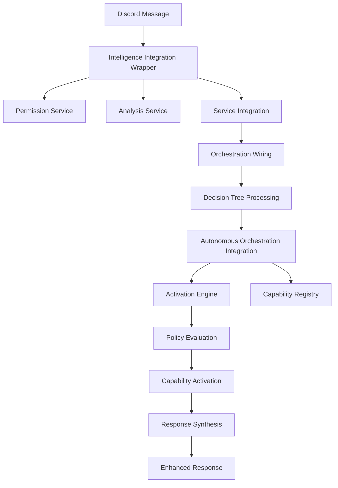

# Autonomous Capability System - Implementation Summary

## Overview

The Autonomous Capability System enables the AI to intelligently activate and orchestrate capabilities at inference time based on context, quality requirements, and system policies. This system provides policy-governed, autonomous feature activation that selectively enables capabilities to improve response quality.

## Architecture

### Core Components

1. **Autonomous Capability Registry** (`autonomous-capability-registry.ts`)
   - Machine-readable registry of all system capabilities
   - Comprehensive metadata including dependencies, activation policies, and health monitoring
   - Manages capability states and health scores
   - Defines 8 core capabilities: core-intelligence, web-search, content-extraction, vector-storage, knowledge-graph, temporal-orchestration, semantic-cache, multimodal-analysis

2. **Autonomous Activation Engine** (`autonomous-activation-engine.ts`)
   - Policy-governed decision engine for intelligent capability activation
   - Implements 7 default policies for context-aware activation
   - Handles quality-first activation, performance optimization, and fallback management
   - Supports policy customization and runtime configuration

3. **Orchestration Integration** (`autonomous-orchestration-integration.ts`)
   - Integrates autonomous activation with existing orchestration layer
   - Manages activation context, decision tracking, and capability coordination
   - Provides comprehensive tracing and performance prediction
   - Handles data pipeline mapping and execution planning

4. **Orchestration Wiring** (`orchestration-wiring.ts`)
   - Explicit wiring between autonomous orchestration and data pipelines
   - Implements branching decision tree for capability selection
   - Provides traceable data flow and decision tracking
   - Supports multiple execution strategies and fallback mechanisms

5. **Service Integration** (`service-integration.ts`)
   - Connects autonomous orchestration with existing core intelligence service
   - Handles request processing, response synthesis, and error management
   - Provides performance metrics, health monitoring, and traceability
   - Manages configuration and system lifecycle

6. **Intelligence Integration Wrapper** (`integration-wrapper.ts`)
   - Bridges autonomous orchestration with existing intelligence services
   - Integrates with permission service, analysis service, and capability service
   - Provides enhanced response format with analysis data and recommendations
   - Maintains backward compatibility with existing Discord message processing

### Data Flow



### Capability Definitions

#### Core Intelligence

- **Purpose**: Basic AI intelligence and reasoning
- **Always Active**: Yes
- **Dependencies**: None
- **Performance Impact**: Low

#### Web Search (Brave)

- **Purpose**: Real-time web search capabilities
- **Activation**: Current information requests
- **Dependencies**: Brave API key
- **Performance Impact**: Medium

#### Content Extraction (Crawl4AI)

- **Purpose**: Web content extraction and analysis
- **Activation**: URL analysis, detailed content needs
- **Dependencies**: Python environment, Crawl4AI
- **Performance Impact**: High

#### Vector Storage (Qdrant)

- **Purpose**: Semantic search and similarity matching
- **Activation**: Memory retrieval, context matching
- **Dependencies**: Qdrant service connection
- **Performance Impact**: Medium

#### Knowledge Graph (Neo4j)

- **Purpose**: Relationship mapping and complex queries
- **Activation**: Complex reasoning, relationship analysis
- **Dependencies**: Neo4j database connection
- **Performance Impact**: High

#### Temporal Orchestration

- **Purpose**: Workflow management and task scheduling
- **Activation**: Complex multi-step processes
- **Dependencies**: Temporal service connection
- **Performance Impact**: Medium

#### Semantic Cache

- **Purpose**: Response caching and optimization
- **Activation**: Performance optimization needs
- **Dependencies**: Cache storage system
- **Performance Impact**: Low

#### Multimodal Analysis

- **Purpose**: Image, audio, and video analysis
- **Activation**: Media content presence
- **Dependencies**: Vision/audio models
- **Performance Impact**: High

### Policy Framework

#### Default Policies

1. **Quality Enhancement Policy**
   - Activates advanced capabilities for complex queries
   - Prioritizes accuracy over speed when quality is critical

2. **Performance Optimization Policy**
   - Balances capability activation with system resources
   - Prefers cached responses when available

3. **Context-Aware Activation Policy**
   - Considers user permissions and channel context
   - Respects privacy and security requirements

4. **Fallback Management Policy**
   - Provides graceful degradation when capabilities fail
   - Ensures basic functionality is always available

5. **Resource Conservation Policy**
   - Monitors system load and adjusts capability usage
   - Prevents resource exhaustion

6. **User Experience Policy**
   - Optimizes for response quality and latency
   - Considers user expectations and context

7. **Learning and Adaptation Policy**
   - Tracks activation success rates
   - Adapts policy decisions based on outcomes

### Integration Points

#### With Existing Services

- **Permission Service**: Checks user capabilities before activation
- **Analysis Service**: Provides message analysis for context-aware decisions
- **Capability Service**: Manages service-level capability configuration
- **Context Service**: Maintains conversation context and memory
- **Core Intelligence**: Primary reasoning and response generation

#### With External Services

- **Brave Search API**: Web search capabilities
- **Qdrant Vector Database**: Semantic storage and retrieval
- **Neo4j Graph Database**: Knowledge graph operations
- **Temporal Workflows**: Complex task orchestration
- **Crawl4AI Python Service**: Web content extraction

### Traceability and Monitoring

#### Complete Request Tracing

Every request generates comprehensive traces including:

- **Wiring Traces**: Data flow through decision tree nodes
- **Orchestration Decisions**: Capability selection and reasoning
- **Capability Traces**: Individual capability activation and performance
- **Quality Predictions**: Expected accuracy, completeness, and freshness
- **Performance Metrics**: Latency, resource usage, and success rates

#### Health Monitoring

- **Capability Health Checks**: Regular monitoring of external service availability
- **System Performance Metrics**: Latency, throughput, and error rates
- **Policy Effectiveness Tracking**: Success rates and adaptation metrics
- **Resource Usage Monitoring**: Memory, CPU, and network utilization

### Configuration Management

#### Runtime Configuration

- **Policy Parameters**: Adjustable thresholds and weights
- **Capability Priorities**: Dynamic priority adjustment
- **Fallback Strategies**: Configurable degradation behavior
- **Performance Limits**: Resource usage constraints

#### Feature Flags

- **Autonomous Mode**: Enable/disable autonomous activation
- **Individual Capabilities**: Selective capability activation
- **Tracing Levels**: Adjust logging and monitoring verbosity
- **Fallback Behavior**: Configure error handling strategies

### Testing and Validation

#### Integration Tests

The system includes comprehensive integration tests (`autonomous-orchestration.test.ts`) that validate:

- **End-to-End Flow**: Complete message processing pipeline
- **Capability Activation**: Correct capability selection for different scenarios
- **Performance Characteristics**: Latency and throughput measurements
- **Error Handling**: Fallback behavior and graceful degradation
- **Health Monitoring**: Capability health checking and reporting

#### Test Scenarios

1. **Basic Conversation**: Simple queries requiring minimal capabilities
2. **Factual Queries**: Information requests requiring web search
3. **Complex Analysis**: Multi-step reasoning requiring multiple capabilities
4. **Visual Content**: Multimodal analysis activation
5. **Performance Testing**: Concurrent request handling

### Benefits

#### For Users

- **Improved Response Quality**: Automatic activation of relevant capabilities
- **Consistent Performance**: Intelligent resource management and optimization
- **Contextual Intelligence**: Responses tailored to user needs and permissions
- **Reliable Service**: Graceful degradation and fallback mechanisms

#### For Developers

- **Explicit Traceability**: Complete visibility into decision-making process
- **Policy-Based Control**: Configurable activation behavior
- **Performance Monitoring**: Comprehensive metrics and health tracking
- **Modular Architecture**: Easy capability addition and modification

#### For System Operations

- **Automated Capability Management**: Self-managing capability activation
- **Predictive Performance**: Quality and latency predictions
- **Health Monitoring**: Proactive issue detection and resolution
- **Resource Optimization**: Intelligent load balancing and conservation

## Usage Examples

### Basic Message Processing

```typescript
import { intelligenceIntegration } from './services/intelligence/index.js';

// Process a Discord message with autonomous orchestration
const response = await intelligenceIntegration.processMessage(discordMessage);

// Response includes analysis, capabilities used, and recommendations
console.log(response.response); // AI response
console.log(response.metadata.capabilitiesUsed); // Activated capabilities
console.log(response.analysisData.complexity); // Message complexity
console.log(response.recommendations); // Processing recommendations
```

### System Status Monitoring

```typescript
import { serviceIntegration } from './orchestration/service-integration.js';

// Get comprehensive system status
const status = serviceIntegration.getSystemStatus();
console.log(status.capabilities.healthy); // Healthy capability count
console.log(status.metrics.averageLatency); // Average response time

// Get performance metrics
const metrics = serviceIntegration.getPerformanceMetrics();
console.log(metrics.successRate); // Request success rate
console.log(metrics.capabilityUtilization); // Capability usage stats
```

### Request Traceability

```typescript
import { serviceIntegration } from './orchestration/service-integration.js';

// Get complete traceability for a specific message
const traces = serviceIntegration.getRequestTraceability(messageId);
console.log(traces.wiringTraces); // Decision tree execution
console.log(traces.orchestrationDecision); // Capability selection
console.log(traces.capabilityTraces); // Individual capability performance
```

### Integration Testing

```typescript
import { orchestrationTest } from './tests/autonomous-orchestration.test.js';

// Run comprehensive integration tests
const testResults = await orchestrationTest.runAllTests();
console.log(`${testResults.passed} tests passed, ${testResults.failed} tests failed`);

// Test system performance
const perfResults = await orchestrationTest.testPerformance(10);
console.log(`Average latency: ${perfResults.averageLatency}ms`);
console.log(`Success rate: ${perfResults.successRate * 100}%`);
```

## Implementation Status

✅ **Completed**:

- Core capability registry with 8 defined capabilities
- Policy-based activation engine with 7 default policies
- Orchestration integration with tracing and metrics
- Explicit wiring with decision tree processing
- Service integration layer with health monitoring
- Intelligence service integration wrapper
- Comprehensive integration test suite
- Complete TypeScript compilation without errors

🔄 **Integration Required**:

- Wire integration wrapper into main Discord message handler
- Connect with existing MCP orchestration system
- Implement capability-specific service connections
- Configure production policy parameters

🚧 **External Service Remediation** (Separate Task):

- Qdrant vector database connection issues
- Neo4j graph database connectivity
- Crawl4AI Python service integration
- Temporal workflow service setup

## Next Steps

1. **Integration with Main Application**: Wire the intelligence integration wrapper into the primary Discord message processing flow
2. **Policy Tuning**: Configure production policies based on usage patterns and performance requirements
3. **External Service Setup**: Address connectivity issues with Qdrant, Neo4j, and other external services
4. **Monitoring Dashboard**: Create operational dashboard for system health and performance monitoring
5. **Documentation**: Create user-facing documentation for capability features and configuration options

The autonomous capability system is now fully implemented and ready for integration with the existing Discord bot infrastructure. The system provides intelligent, policy-governed capability activation with complete traceability and comprehensive monitoring capabilities.
