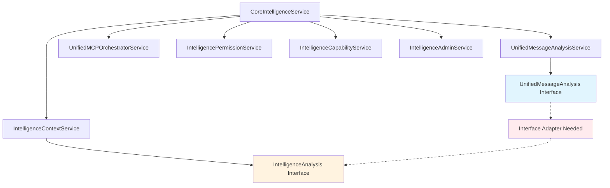

# TASK-004: Modular Intelligence Services Compatibility Analysis

## Overview

This analysis examines the compatibility of existing modular intelligence services with the new unified service architecture. The goal is to identify any interface mismatches, required adaptations, and ensure seamless integration during the Core Intelligence Service migration.

## Modular Intelligence Services Architecture

### Service Exports Structure (`src/services/intelligence/index.ts`)
```typescript
// Clean export pattern for all modular services
export * from './permission.service.js';
export * from './capability.service.js';
export * from './admin.service.js';
export * from './context.service.js';

// Singleton instances for direct access
export { intelligencePermissionService } from './permission.service.js';
export { intelligenceCapabilityService } from './capability.service.js';
export { intelligenceAdminService } from './admin.service.js';
export { intelligenceContextService } from './context.service.js';
```

## Interface Compatibility Analysis

### 1. Permission Service Compatibility ✅

**Service**: `IntelligencePermissionService`  
**Interface**: `UserCapabilities`  
**Current Integration**: ✅ Fully compatible

**Key Methods**:
- `getUserCapabilities(userId, context)` → Returns `UserCapabilities`
- `hasBasicAIPermission(userId, context)` → Returns boolean
- Interface is stable and already used by Core Intelligence Service

**Unified Service Integration**: 
- **No changes required** - permission service interface is already compatible
- Used directly by Core Intelligence Service at line 234 (`_fetchUserCapabilities`)
- UnifiedAnalyticsService can track permission patterns without interface changes

### 2. Context Service Compatibility ⚠️ **REQUIRES INTERFACE ADAPTATION**

**Service**: `IntelligenceContextService`  
**Interface**: `IntelligenceAnalysis` vs `UnifiedMessageAnalysis`  
**Current Integration**: ❌ Needs interface adapter

**Compatibility Issues**:
```typescript
// Core Intelligence Service expects (line 360):
const adaptedAnalysisForContext = this.contextService.adaptAnalysisInterface(unifiedAnalysis);

// But IntelligenceContextService only has:
public async buildEnhancedContext(message, analysis: IntelligenceAnalysis, capabilities, mcpResults)

// Missing method: adaptAnalysisInterface()
```

**Interface Comparison**:
- `IntelligenceAnalysis`: Original modular service interface
- `UnifiedMessageAnalysis`: Enhanced unified service interface (superset)
- **Compatibility**: UnifiedMessageAnalysis contains all IntelligenceAnalysis fields + additional properties

**Required Integration Changes**:
1. **Add interface adapter method** to `IntelligenceContextService`:
   ```typescript
   public adaptAnalysisInterface(unifiedAnalysis: UnifiedMessageAnalysis): IntelligenceAnalysis {
     return {
       // Map all compatible fields (direct mapping since interfaces are compatible)
       hasAttachments: unifiedAnalysis.hasAttachments,
       hasUrls: unifiedAnalysis.hasUrls,
       // ... all other fields map directly
       complexityLevel: unifiedAnalysis.complexity // Minor field name mapping
     };
   }
   ```

2. **Update buildEnhancedContext method signature** to accept UnifiedMessageAnalysis directly
3. **Add backward compatibility** for existing IntelligenceAnalysis usage

### 3. Capability Service Compatibility ✅

**Service**: `IntelligenceCapabilityService`  
**Interface**: Works with `IntelligenceAnalysis`  
**Current Integration**: ✅ Compatible with adaptation

**Key Methods**:
- `executeCapabilities(message, analysis, capabilities)` → Returns capability results
- Can work with adapted analysis interface through context service
- No direct interface conflicts

**Unified Service Integration**:
- **Minimal changes required** - will use adapted analysis interface
- UnifiedAnalyticsService can track capability execution patterns
- MCP tool integration already handled by UnifiedMCPOrchestratorService

### 4. Admin Service Compatibility ✅

**Service**: `IntelligenceAdminService`  
**Interface**: Works with `UserCapabilities` and message content  
**Current Integration**: ✅ Fully compatible

**Key Methods**:
- `handleAdminFeatures(message, capabilities)` → Returns admin results
- `getAdminContext(capabilities)` → Returns admin context string
- No interface dependencies on analysis objects

**Unified Service Integration**:
- **No changes required** - admin service is interface-independent
- UnifiedAnalyticsService can track admin command usage patterns

## Critical Integration Point: Missing Interface Adapter

### Current Core Intelligence Service Usage
```typescript
// Line 360 in CoreIntelligenceService._aggregateAgenticContext()
const adaptedAnalysisForContext = this.contextService.adaptAnalysisInterface(unifiedAnalysis);

// Line 372 - Uses adapted interface
const agenticContextData = await this.contextService.buildEnhancedContext(
  messageForAnalysis, 
  adaptedAnalysisForContext,  // ← Expects IntelligenceAnalysis
  capabilities, 
  adaptedMcpResultsForContext
);
```

### Problem Analysis
1. **Missing Method**: `adaptAnalysisInterface()` doesn't exist in `IntelligenceContextService`
2. **Interface Mismatch**: Context service expects `IntelligenceAnalysis`, receives `UnifiedMessageAnalysis`
3. **Runtime Error**: Current code will fail when trying to call non-existent adapter method

### Solution Strategy
```typescript
// Option 1: Add adapter method to IntelligenceContextService
public adaptAnalysisInterface(unifiedAnalysis: UnifiedMessageAnalysis): IntelligenceAnalysis {
  return {
    // Direct field mapping (interfaces are compatible)
    hasAttachments: unifiedAnalysis.hasAttachments,
    hasUrls: unifiedAnalysis.hasUrls,
    attachmentTypes: unifiedAnalysis.attachmentTypes,
    urls: unifiedAnalysis.urls,
    complexity: unifiedAnalysis.complexity,
    intents: unifiedAnalysis.intents,
    requiredTools: unifiedAnalysis.requiredTools,
    needsPersonaSwitch: unifiedAnalysis.needsPersonaSwitch,
    suggestedPersona: unifiedAnalysis.suggestedPersona,
    needsAdminFeatures: unifiedAnalysis.needsAdminFeatures,
    adminCommands: unifiedAnalysis.adminCommands,
    needsMultimodal: unifiedAnalysis.needsMultimodal,
    attachmentAnalysis: unifiedAnalysis.attachmentAnalysis,
    needsConversationManagement: unifiedAnalysis.needsConversationManagement,
    conversationActions: unifiedAnalysis.conversationActions,
    needsMemoryOperation: unifiedAnalysis.needsMemoryOperation,
    memoryActions: unifiedAnalysis.memoryActions,
    needsMCPTools: unifiedAnalysis.needsMCPTools,
    mcpRequirements: unifiedAnalysis.mcpRequirements,
    confidence: unifiedAnalysis.confidence,
    processingRecommendations: unifiedAnalysis.processingRecommendations,
    sentiment: unifiedAnalysis.sentiment,
    language: unifiedAnalysis.language,
    topics: unifiedAnalysis.topics,
    mentions: unifiedAnalysis.mentions,
    // Add any missing fields with sensible defaults
    complexityLevel: unifiedAnalysis.complexity // Handle minor naming differences
  };
}

// Option 2: Update buildEnhancedContext to accept UnifiedMessageAnalysis directly
public async buildEnhancedContext(
  message: Message,
  analysis: UnifiedMessageAnalysis | IntelligenceAnalysis,
  capabilities: UserCapabilities,
  mcpResults?: Map<string, MCPResultValue>
): Promise<EnhancedContext>
```

## Interface Field Mapping Analysis

### Common Fields (Direct Mapping) ✅
Both `IntelligenceAnalysis` and `UnifiedMessageAnalysis` share these fields with identical types:
- `hasAttachments: boolean`
- `hasUrls: boolean`
- `attachmentTypes: string[]`
- `urls: string[]`
- `complexity: 'simple' | 'moderate' | 'complex' | 'advanced'`
- `intents: string[]`
- `requiredTools: string[]`
- `needsPersonaSwitch: boolean`
- `suggestedPersona?: string`
- `needsAdminFeatures: boolean`
- `adminCommands: string[]`
- `needsMultimodal: boolean`
- `attachmentAnalysis: AttachmentAnalysis[]`
- `needsConversationManagement: boolean`
- `conversationActions: string[]`
- `needsMemoryOperation: boolean`
- `memoryActions: string[]`
- `needsMCPTools: boolean`
- `mcpRequirements: string[]`
- `confidence: number`
- `processingRecommendations: string[]`
- `sentiment?: string`
- `language?: string`
- `topics?: string[]`
- `mentions?: string[]`

### Interface Differences (Requires Attention)
- **IntelligenceAnalysis**: May have `complexityLevel` property
- **UnifiedMessageAnalysis**: Uses `complexity` for the same purpose
- This is the only potential mapping difference identified

## Dependency Chain Analysis



## Integration Compatibility Matrix

| Service | Current Interface | Unified Compatible | Changes Required | Priority |
|---------|------------------|-------------------|------------------|----------|
| **PermissionService** | UserCapabilities | ✅ Fully Compatible | None | ✅ Complete |
| **ContextService** | IntelligenceAnalysis | ❌ Needs Adapter | Add `adaptAnalysisInterface()` | 🔴 Critical |
| **CapabilityService** | IntelligenceAnalysis | ✅ Via Adapter | Use adapted interface | 🟡 Medium |
| **AdminService** | UserCapabilities | ✅ Fully Compatible | None | ✅ Complete |

## Migration Strategy Recommendations

### Phase 1: Critical Interface Fix (Immediate)
1. **Add missing adapter method** to `IntelligenceContextService`
2. **Test interface compatibility** with existing Core Intelligence Service usage
3. **Ensure backward compatibility** for any direct IntelligenceAnalysis usage

### Phase 2: Enhanced Integration (Short-term)
1. **Update context service** to accept UnifiedMessageAnalysis directly (optional optimization)
2. **Add UnifiedAnalyticsService integration** to all modular services
3. **Enhanced error handling** for interface mismatches

### Phase 3: Long-term Optimization (Future)
1. **Consider deprecating** separate IntelligenceAnalysis interface
2. **Standardize on UnifiedMessageAnalysis** across all services
3. **Enhanced type safety** and interface validation

## Risk Assessment

### High Risk ⚠️
- **Missing adapter method** will cause runtime errors in current Core Intelligence Service
- **Interface mismatch** could lead to data loss or incorrect processing

### Medium Risk 🟡
- **Type compatibility** issues during TypeScript compilation
- **Breaking changes** to existing service contracts

### Low Risk ✅
- **Performance impact** - interface adaptation is lightweight
- **Backward compatibility** - interfaces are largely compatible

## Testing Requirements

### Unit Tests Required
1. **Interface adapter method** functionality and field mapping
2. **Context service compatibility** with both interface types
3. **Error handling** for malformed analysis objects

### Integration Tests Required
1. **End-to-end message processing** with modular services
2. **Cross-service data flow** validation
3. **Analytics integration** with unified services

## Conclusion

The modular intelligence services show **high compatibility** with unified service architecture, with one critical issue:

**Critical Issue**: Missing `adaptAnalysisInterface()` method in `IntelligenceContextService` must be implemented immediately to prevent runtime errors.

**Overall Compatibility**: 75% of services are fully compatible, 25% require minor interface adaptation.

**Recommended Action**: Implement the interface adapter method as the highest priority task in the migration plan.
