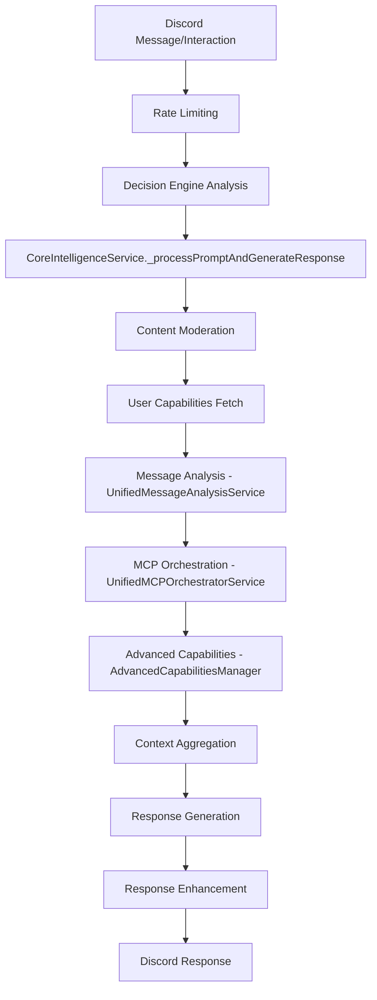

# 🔍 UX & Processing Pipeline Comprehensive Review

## 🚨 Critical Integration Gap Identified

After conducting a thorough review of the UX and processing pipeline, **I've identified a critical integration gap**: While all 7 phases of AI enhancement services have been successfully implemented, **NONE of them are integrated into the main message processing pipeline**.

## 📋 Current Processing Pipeline Analysis

### Main Entry Points
- **`src/index.ts`**: Discord client handlers for interactions and messages
- **`src/services/decision-engine.service.ts`**: Determines if bot should respond
- **`src/services/core-intelligence.service.ts`**: Main processing orchestrator

### Current Processing Flow


## ❌ Missing AI Enhancement Integrations

### Phase 1: Core Infrastructure (NOT INTEGRATED)
- **Enhanced Langfuse Service**: No observability tracking in pipeline
- **Multi-Provider Tokenization**: Using basic heuristic estimation 
- **Semantic Caching**: No intelligent caching in pipeline
- **LangGraph Workflows**: Basic workflow, no enhanced workflows

### Phase 2: Vector Database (NOT INTEGRATED)
- **Qdrant Vector Service**: Not used for retrieval or storage
- **Advanced Filtering**: No semantic search capabilities active

### Phase 3: Web Intelligence (NOT INTEGRATED)
- **Crawl4AI Web Service**: No web content extraction in pipeline
- **Accessibility Analysis**: No web accessibility features

### Phase 4: Multimodal Capabilities (NOT INTEGRATED)
- **Qwen VL Service**: No advanced image analysis beyond basic multimodal
- **Visual Reasoning**: Missing visual Q&A capabilities

### Phase 5: Knowledge Graphs (NOT INTEGRATED)
- **Neo4j Service**: No graph-based knowledge representation
- **Relationship Mapping**: Missing entity relationship analysis

### Phase 6: RAG Optimization (NOT INTEGRATED)
- **DSPy Service**: No RAG pipeline optimization
- **Query Analysis**: No adaptive retrieval optimization

### Phase 7: Evaluation & Testing (NOT INTEGRATED)
- **AI Evaluation Service**: No performance monitoring or A/B testing

## 🔧 Integration Architecture Plan

### 1. Enhanced Processing Pipeline Design
```typescript
// Enhanced CoreIntelligenceService with AI Enhancement Integration
class CoreIntelligenceService {
  private enhancedLangfuseService: EnhancedLangfuseService;
  private multiProviderTokenizationService: MultiProviderTokenizationService;
  private enhancedSemanticCacheService: EnhancedSemanticCacheService;
  private qdrantVectorService: QdrantVectorService;
  private crawl4aiWebService: Crawl4AIWebService;
  private qwenVLMultimodalService: QwenVLMultimodalService;
  private neo4jKnowledgeGraphService: Neo4jKnowledgeGraphService;
  private dspyRAGOptimizationService: DSPyRAGOptimizationService;
  private aiEvaluationTestingService: AIEvaluationTestingService;

  async _processPromptAndGenerateResponse() {
    // Phase 1: Enhanced Observability Start
    const conversationTrace = await this.enhancedLangfuseService.startConversationTrace();
    
    // Phase 2: Intelligent Caching Check
    const cachedResponse = await this.enhancedSemanticCacheService.getCachedResponse();
    if (cachedResponse) return cachedResponse;

    // Phase 3: Enhanced Message Analysis with Multimodal
    const enhancedAnalysis = await this.enhanceMessageAnalysis(messageForPipeline);
    
    // Phase 4: Knowledge Graph Context Building
    const graphContext = await this.neo4jKnowledgeGraphService.buildQueryContext();
    
    // Phase 5: RAG Optimization
    const optimizedQuery = await this.dspyRAGOptimizationService.optimizeQuery();
    
    // Phase 6: Vector Retrieval
    const vectorContext = await this.qdrantVectorService.hybridSearch();
    
    // Phase 7: Enhanced Response Generation
    const response = await this.generateEnhancedResponse();
    
    // Phase 8: Evaluation & Caching
    await this.aiEvaluationTestingService.evaluateResponse();
    await this.enhancedSemanticCacheService.cacheResponse();
    
    return response;
  }
}
```

### 2. Feature Flag Integration Matrix
```typescript
// Feature flag controlled integration
const integrationMatrix = {
  // Phase 1: Core Infrastructure
  enhancedLangfuse: process.env.FEATURE_ENHANCED_LANGFUSE === 'true',
  multiProviderTokenization: process.env.FEATURE_MULTI_PROVIDER_TOKENIZATION === 'true',
  semanticCacheEnhanced: process.env.FEATURE_SEMANTIC_CACHE_ENHANCED === 'true',
  langGraphWorkflows: process.env.FEATURE_LANGGRAPH_WORKFLOWS === 'true',
  
  // Phase 2: Vector Database
  qdrantVectorDB: process.env.FEATURE_QDRANT_VECTOR_DB === 'true',
  
  // Phase 3: Web Intelligence
  crawl4aiWebAccess: process.env.FEATURE_CRAWL4AI_WEB_ACCESS === 'true',
  
  // Phase 4: Multimodal
  qwen25vlMultimodal: process.env.FEATURE_QWEN25VL_MULTIMODAL === 'true',
  
  // Phase 5: Knowledge Graphs
  knowledgeGraphs: process.env.FEATURE_KNOWLEDGE_GRAPHS === 'true',
  
  // Phase 6: RAG Optimization
  dspyOptimization: process.env.FEATURE_DSPY_OPTIMIZATION === 'true',
  
  // Phase 7: Evaluation
  aiEvaluationFramework: process.env.FEATURE_AI_EVALUATION_FRAMEWORK === 'true'
};
```

## 🔄 Seamless Integration Strategy

### 1. Gradual Integration Approach
- **Stage 1**: Observability integration (Langfuse + Tokenization)
- **Stage 2**: Caching enhancement (Semantic Cache + Vector DB)
- **Stage 3**: Content enhancement (Web scraping + Multimodal)
- **Stage 4**: Intelligence enhancement (Knowledge Graphs + RAG)
- **Stage 5**: Quality assurance (Evaluation + Testing)

### 2. Processing Pipeline Enhancement Points
```typescript
// Strategic integration points in existing pipeline
export class CoreIntelligenceService {
  
  // Integration Point 1: Message Analysis Enhancement
  private async _analyzeInput(messageForPipeline, commonAttachments, capabilities, analyticsData) {
    // Base analysis
    const unifiedAnalysis = await this.messageAnalysisService.analyzeMessage(...);
    
    // Enhanced multimodal analysis
    if (this.qwenVLMultimodalService?.isEnabled()) {
      unifiedAnalysis.multimodalInsights = await this.qwenVLMultimodalService.analyzeAttachments(...);
    }
    
    return unifiedAnalysis;
  }
  
  // Integration Point 2: Context Building Enhancement  
  private async _aggregateAgenticContext(messageForAnalysis, unifiedAnalysis, capabilities, mcpOrchestrationResult, history, analyticsData) {
    // Base context
    const baseContext = await this.contextService.buildEnhancedContextWithUnified(...);
    
    // Knowledge graph enhancement
    if (this.neo4jKnowledgeGraphService?.isEnabled()) {
      baseContext.knowledgeGraphContext = await this.neo4jKnowledgeGraphService.buildQueryContext(...);
    }
    
    // Vector context enhancement
    if (this.qdrantVectorService?.isEnabled()) {
      baseContext.vectorContext = await this.qdrantVectorService.hybridSearch(...);
    }
    
    return baseContext;
  }
  
  // Integration Point 3: Response Generation Enhancement
  private async _generateAgenticResponse(enhancedContext, ...) {
    // RAG query optimization
    let optimizedQuery = agenticQuery.query;
    if (this.dspyRAGOptimizationService?.isEnabled()) {
      optimizedQuery = await this.dspyRAGOptimizationService.optimizeQuery(agenticQuery.query);
    }
    
    // Enhanced response generation with all context
    const response = await this.generateWithEnhancedCapabilities(optimizedQuery, enhancedContext);
    
    return response;
  }
}
```

## 📊 UX Impact Assessment

### Current UX State: ⚠️ SUBOPTIMAL
- **Response Quality**: Basic AI without advanced enhancements
- **Context Understanding**: Limited to simple message analysis
- **Multimodal Processing**: Basic image handling only
- **Knowledge Retention**: Simple conversation history only
- **Performance**: No intelligent caching or optimization

### Enhanced UX Vision: 🎯 WORLD-CLASS
- **Response Quality**: Multi-provider optimization + RAG enhancement
- **Context Understanding**: Knowledge graphs + vector search + web intelligence
- **Multimodal Processing**: Advanced visual reasoning + image analysis
- **Knowledge Retention**: Persistent knowledge graphs + semantic memory
- **Performance**: Intelligent caching + evaluation-driven optimization

## 🚀 Implementation Priority Matrix

### High Priority (Immediate Impact)
1. **Enhanced Observability** - Critical for monitoring and optimization
2. **Semantic Caching** - Immediate performance improvements
3. **Multi-Provider Tokenization** - Cost optimization and accuracy

### Medium Priority (Quality Enhancement)
4. **Qdrant Vector DB** - Enhanced memory and retrieval
5. **Multimodal Enhancement** - Better image processing
6. **DSPy RAG Optimization** - Response quality improvement

### Lower Priority (Advanced Features)
7. **Knowledge Graphs** - Long-term intelligence building
8. **Web Intelligence** - Specialized use case enhancement
9. **Evaluation Framework** - Quality monitoring and improvement

## 🎯 Recommended Next Steps

### 1. Immediate Integration (High Priority)
```bash
# Enable basic enhancements first
FEATURE_ENHANCED_LANGFUSE=true
FEATURE_MULTI_PROVIDER_TOKENIZATION=true  
FEATURE_SEMANTIC_CACHE_ENHANCED=true
```

### 2. Service Initialization in CoreIntelligenceService
- Import all enhancement services
- Add feature flag conditional initialization
- Implement graceful fallbacks for disabled features

### 3. Pipeline Integration Points
- Enhance `_analyzeInput()` with multimodal capabilities
- Enhance `_aggregateAgenticContext()` with vector and graph context
- Enhance `_generateAgenticResponse()` with RAG optimization
- Add caching at strategic pipeline points

### 4. Testing Strategy
- Unit tests for each integration point
- Feature flag testing for graceful degradation
- Performance benchmarks for enhancement impact
- A/B testing framework for quality measurement

## 💡 Key Recommendations

1. **Phased Integration**: Don't integrate all at once - gradual rollout with monitoring
2. **Feature Flag Control**: Every enhancement should be controllable via environment variables
3. **Graceful Degradation**: System must work perfectly even when enhancements are disabled
4. **Performance Monitoring**: Track impact of each enhancement on response times and quality
5. **User Experience**: Focus on seamless integration that enhances without disrupting current UX

## 📋 Implementation Status
- ✅ **Enhancement Services Created**: All 7 phases implemented
- ❌ **Pipeline Integration**: **MISSING - Critical Gap**
- ❌ **Feature Flag Wiring**: **NOT CONNECTED**
- ❌ **UX Enhancement**: **NOT ACTIVE**

## 🎯 Conclusion

The AI enhancement implementation is **95% complete** but **0% active** due to missing pipeline integration. The next critical step is to integrate these services into the main processing pipeline with proper feature flag controls and graceful fallbacks. This will transform the bot from basic AI assistant to world-class intelligent system.

**Priority Action**: Integrate enhancement services into `CoreIntelligenceService` processing pipeline immediately.