# TASK-005: Migration Compatibility Matrix

## Overview

This document provides a comprehensive compatibility matrix comparing current Core Intelligence Service implementation with unified service interfaces, documenting migration paths and required changes for seamless integration.

## Service Integration Matrix

### Current vs Unified Service Interfaces

| **Service Category** | **Current Implementation** | **Unified Service** | **Compatibility Status** | **Migration Action** |
|---------------------|---------------------------|---------------------|-------------------------|---------------------|
| **Message Analysis** | ✅ Already integrated | `UnifiedMessageAnalysisService` | ✅ **Fully Compatible** | No changes needed |
| **MCP Orchestration** | ✅ Already integrated | `UnifiedMCPOrchestratorService` | ✅ **Fully Compatible** | No changes needed |
| **Analytics & Logging** | ❌ Legacy `logInteraction()` | `UnifiedAnalyticsService` | 🔴 **Needs Integration** | Replace analytics wrapper |
| **Permission Management** | ✅ `intelligencePermissionService` | N/A (stays modular) | ✅ **Fully Compatible** | Enhanced analytics only |
| **Context Building** | ⚠️ Missing interface adapter | `intelligenceContextService` | 🟡 **Needs Interface Fix** | Add adapter method |
| **Capability Execution** | ✅ `intelligenceCapabilityService` | N/A (stays modular) | ✅ **Compatible via adapter** | Use adapted interfaces |
| **Admin Features** | ✅ `intelligenceAdminService` | N/A (stays modular) | ✅ **Fully Compatible** | Enhanced analytics only |

## Interface Compatibility Details

### 1. Already Integrated Unified Services ✅

#### UnifiedMessageAnalysisService
**Current Integration:**
```typescript
// Line 33: Import statement
import { unifiedMessageAnalysisService, UnifiedMessageAnalysis, AttachmentInfo } from './core/message-analysis.service';

// Line 92: Service instance
private readonly messageAnalysisService: typeof unifiedMessageAnalysisService;

// Line 333: Usage in message processing
const unifiedAnalysis = await unifiedMessageAnalysisService.analyzeMessage(messageForPipeline, analysisAttachmentsData, capabilities);
```

**Compatibility Status:** ✅ **Fully Integrated and Working**
- No migration needed
- Interface already established and tested
- Used throughout message processing pipeline

#### UnifiedMCPOrchestratorService
**Current Integration:**
```typescript
// Line 16: Import statement
import { UnifiedMCPOrchestratorService, MCPOrchestrationResult, MCPToolResult } from './core/mcp-orchestrator.service';

// Line 84: Service instance
private readonly mcpOrchestrator: UnifiedMCPOrchestratorService;

// Line 106: Initialization
this.mcpOrchestrator = new UnifiedMCPOrchestratorService(config.mcpManager);

// Usage in _executeMcpPipeline()
const mcpResult = await this.mcpOrchestrator.orchestrateIntelligentResponse(messageForAnalysis, unifiedAnalysis, capabilities);
```

**Compatibility Status:** ✅ **Fully Integrated and Working**
- No migration needed
- Comprehensive tool orchestration implemented
- Handles fallbacks and error recovery

### 2. Critical Integration Required 🔴

#### UnifiedAnalyticsService (Missing)
**Current Implementation:**
```typescript
// Line 49: Legacy analytics import
import { logInteraction } from './analytics';

// Line 135-144: Wrapper method
private recordAnalyticsInteraction(data: any): void {
    logInteraction({
        userId: data.userId,
        guildId: data.guildId,
        interactionType: data.commandOrEvent || 'unknown',
        // ... additional data
    }).catch(err => logger.warn('Analytics logging failed', err));
}
```

**Required Migration:**
```typescript
// Add import
import { UnifiedAnalyticsService } from './core/unified-analytics.service';

// Add service instance
private readonly analyticsService: UnifiedAnalyticsService;

// Initialize in constructor
this.analyticsService = new UnifiedAnalyticsService();

// Replace wrapper method usage
// From: this.recordAnalyticsInteraction({...})
// To: await this.analyticsService.trackInteraction({...})
```

**Migration Impact:**
- **Lines to update:** ~15 analytics calls throughout the service
- **Data format:** Needs mapping from current format to unified service interface
- **Benefits:** Enhanced dashboard, reporting, and analytics capabilities

### 3. Interface Adaptation Required 🟡

#### IntelligenceContextService (Missing Adapter)
**Current Problem:**
```typescript
// Line 360: Calls non-existent method
const adaptedAnalysisForContext = this.contextService.adaptAnalysisInterface(unifiedAnalysis);

// Line 372: Uses adapted interface
const agenticContextData = await this.contextService.buildEnhancedContext(messageForAnalysis, adaptedAnalysisForContext, capabilities, adaptedMcpResultsForContext);
```

**Required Fix:**
```typescript
// Add to IntelligenceContextService class
public adaptAnalysisInterface(unifiedAnalysis: UnifiedMessageAnalysis): IntelligenceAnalysis {
  return {
    // Direct field mapping (interfaces are 95% compatible)
    hasAttachments: unifiedAnalysis.hasAttachments,
    hasUrls: unifiedAnalysis.hasUrls,
    attachmentTypes: unifiedAnalysis.attachmentTypes,
    urls: unifiedAnalysis.urls,
    complexity: unifiedAnalysis.complexity,
    intents: unifiedAnalysis.intents,
    requiredTools: unifiedAnalysis.requiredTools,
    needsPersonaSwitch: unifiedAnalysis.needsPersonaSwitch,
    suggestedPersona: unifiedAnalysis.suggestedPersona,
    needsAdminFeatures: unifiedAnalysis.needsAdminFeatures,
    adminCommands: unifiedAnalysis.adminCommands,
    needsMultimodal: unifiedAnalysis.needsMultimodal,
    attachmentAnalysis: unifiedAnalysis.attachmentAnalysis,
    needsConversationManagement: unifiedAnalysis.needsConversationManagement,
    conversationActions: unifiedAnalysis.conversationActions,
    needsMemoryOperation: unifiedAnalysis.needsMemoryOperation,
    memoryActions: unifiedAnalysis.memoryActions,
    needsMCPTools: unifiedAnalysis.needsMCPTools,
    mcpRequirements: unifiedAnalysis.mcpRequirements,
    confidence: unifiedAnalysis.confidence,
    processingRecommendations: unifiedAnalysis.processingRecommendations,
    sentiment: unifiedAnalysis.sentiment,
    language: unifiedAnalysis.language,
    topics: unifiedAnalysis.topics,
    mentions: unifiedAnalysis.mentions,
    // Handle any naming differences
    complexityLevel: unifiedAnalysis.complexity
  };
}
```

**Migration Impact:**
- **Critical fix:** Required to prevent runtime errors
- **Interface compatibility:** 100% field mapping possible
- **Testing required:** Ensure adapter works correctly with both interface types

## Data Flow Compatibility Analysis

### Current Message Processing Pipeline

```mermaid
graph TD
    A[User Input] --> B[Core Intelligence Service]
    B --> C[Moderation Check]
    C --> D[User Capabilities]
    D --> E[UnifiedMessageAnalysis ✅]
    E --> F[UnifiedMCPOrchestrator ✅]
    F --> G[Context Service ⚠️]
    G --> H[Response Generation]
    H --> I[Analytics ❌]
    I --> J[Final Response]
    
    style E fill:#c8e6c9
    style F fill:#c8e6c9
    style G fill:#fff3e0
    style I fill:#ffcdd2
```



### Target Unified Architecture

```mermaid
graph TD
    A[User Input] --> B[Core Intelligence Service]
    B --> C[Moderation Check]
    C --> D[User Capabilities]
    D --> E[UnifiedMessageAnalysis ✅]
    E --> F[UnifiedMCPOrchestrator ✅]
    F --> G[Context Service ✅]
    G --> H[Response Generation]
    H --> I[UnifiedAnalytics ✅]
    I --> J[Final Response]
    
    style E fill:#c8e6c9
    style F fill:#c8e6c9
    style G fill:#c8e6c9
    style I fill:#c8e6c9
```



## Migration Priority Matrix

| **Component** | **Priority** | **Effort** | **Risk** | **Migration Order** |
|---------------|-------------|------------|----------|-------------------|
| **Context Service Interface Fix** | 🔴 Critical | Low | High | **1st - Immediate** |
| **UnifiedAnalyticsService Integration** | 🟠 High | Medium | Medium | **2nd - Phase 1** |
| **Enhanced Analytics Features** | 🟡 Medium | Medium | Low | **3rd - Phase 2** |
| **Performance Optimization** | 🟢 Low | Low | Low | **4th - Phase 3** |

## Interface Mapping Details

### Analytics Data Mapping

#### Current Analytics Format
```typescript
// Legacy logInteraction() format
{
  userId: string,
  guildId: string | null,
  interactionType: string,
  promptLength: number,
  attachmentCount: number,
  startTime: number,
  step: string,
  isSuccess: boolean,
  error?: string,
  duration: number
}
```

#### Target UnifiedAnalytics Format
```typescript
// UnifiedAnalyticsService expected format (needs verification)
{
  userId: string,
  guildId: string | null,
  sessionId: string,
  interactionType: string,
  eventType: string,
  metadata: {
    promptLength: number,
    attachmentCount: number,
    step: string,
    duration: number,
    mcpToolsUsed?: string[],
    complexityLevel?: string
  },
  timestamp: Date,
  success: boolean,
  errorDetails?: string
}
```

#### Required Data Transformation
```typescript
// Mapping function needed
private mapLegacyAnalyticsToUnified(legacyData: any): UnifiedAnalyticsData {
  return {
    userId: legacyData.userId,
    guildId: legacyData.guildId,
    sessionId: `${legacyData.userId}-${Date.now()}`, // Generate session ID
    interactionType: legacyData.commandOrEvent || 'unknown',
    eventType: legacyData.step,
    metadata: {
      promptLength: legacyData.promptLength,
      attachmentCount: legacyData.attachmentCount,
      step: legacyData.step,
      duration: legacyData.duration,
      // Add enhanced fields
      mcpToolsUsed: legacyData.mcpToolsExecuted?.split(',') || [],
      complexityLevel: legacyData.complexityLevel
    },
    timestamp: new Date(legacyData.startTime),
    success: legacyData.isSuccess,
    errorDetails: legacyData.error
  };
}
```

## Migration Steps with Current vs Target

### Step 1: Critical Interface Fix
**Current State:**
```typescript
// Fails at runtime - method doesn't exist
const adaptedAnalysisForContext = this.contextService.adaptAnalysisInterface(unifiedAnalysis);
```

**Target State:**
```typescript
// Works correctly with new adapter method
const adaptedAnalysisForContext = this.contextService.adaptAnalysisInterface(unifiedAnalysis);
```

### Step 2: Analytics Service Integration
**Current State:**
```typescript
// Line 135: Legacy wrapper
private recordAnalyticsInteraction(data: any): void {
    logInteraction({...}).catch(err => logger.warn('Analytics logging failed', err));
}
```

**Target State:**
```typescript
// Direct unified service usage
private async recordAnalyticsInteraction(data: any): Promise<void> {
    try {
        const unifiedData = this.mapLegacyAnalyticsToUnified(data);
        await this.analyticsService.trackInteraction(unifiedData);
    } catch (error) {
        logger.warn('Analytics logging failed', { error });
    }
}
```

### Step 3: Enhanced Analytics Integration
**Current State:**
```typescript
// Basic analytics at processing stages
this.recordAnalyticsInteraction({ ...analyticsData, step: 'start_processing' });
```

**Target State:**
```typescript
// Enhanced analytics with unified service capabilities
await this.analyticsService.trackProcessingStage({
    stage: 'start_processing',
    context: analyticsData,
    performance: { startTime: Date.now() },
    userBehavior: { interactionPattern: 'slash_command' }
});
```

## Risk Assessment Matrix

| **Risk Category** | **Current Risk** | **Mitigation Strategy** | **Post-Migration Risk** |
|------------------|------------------|------------------------|------------------------|
| **Runtime Errors** | 🔴 High (missing adapter) | Add interface adapter immediately | 🟢 Low |
| **Data Loss** | 🟡 Medium (analytics gaps) | Preserve legacy analytics during transition | 🟢 Low |
| **Performance** | 🟢 Low | Optimize unified service calls | 🟢 Low |
| **Breaking Changes** | 🟡 Medium | Maintain backward compatibility | 🟢 Low |
| **Testing Coverage** | 🟡 Medium | Comprehensive migration testing | 🟢 Low |

## Success Criteria

### Phase 1 Success Criteria
- [ ] Context service adapter method implemented and tested
- [ ] No runtime errors in message processing pipeline
- [ ] All existing functionality preserved
- [ ] Basic analytics still functional

### Phase 2 Success Criteria  
- [ ] UnifiedAnalyticsService fully integrated
- [ ] Enhanced analytics dashboard functional
- [ ] Performance metrics improved or maintained
- [ ] All tests passing

### Phase 3 Success Criteria
- [ ] Complete unified architecture integration
- [ ] Enhanced features utilizing unified services
- [ ] Comprehensive monitoring and reporting
- [ ] Documentation updated

## Conclusion

The migration compatibility analysis reveals:

**✅ Strengths:**
- 67% of unified services already integrated (Message Analysis, MCP Orchestration)
- High interface compatibility between existing and unified services
- Modular architecture supports gradual migration

**⚠️ Critical Issues:**
- Missing interface adapter method (immediate fix required)
- Legacy analytics system needs replacement
- Interface mapping required for some services

**🎯 Migration Path:**
- **Phase 1:** Fix critical interface issues (1-2 days)
- **Phase 2:** Integrate UnifiedAnalyticsService (3-5 days)
- **Phase 3:** Enhanced features and optimization (ongoing)

**Overall Assessment:** **High migration feasibility** with focused effort on identified compatibility gaps.
